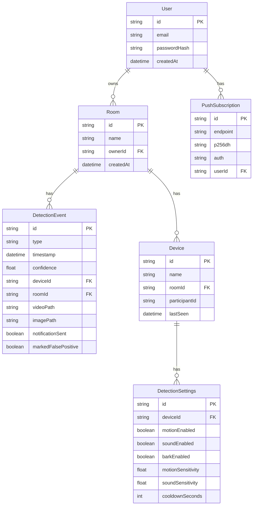

# feat: Pet Monitoring with Motion/Sound Detection and Alerts

**Created**: 2025-12-26
**Status**: Draft
**Type**: Enhancement
**Complexity**: High

---

## Overview

Add intelligent pet monitoring capabilities to Pet Portal that automatically detect motion and sounds (specifically barking), capture video/audio/image proof when events are detected, and notify the stream owner in real-time via push notifications.

---

## Problem Statement / Motivation

Currently, Pet Portal streams live video from cameras to viewers, but users must actively watch to notice pet activity. This creates several pain points:

1. **Missed Events**: Users cannot watch 24/7 and miss important pet behavior
2. **No Proof**: When something happens, there's no automatic recording for later review
3. **No Alerts**: Users aren't notified when their pet is active, barking, or potentially in distress
4. **Manual Monitoring**: The app requires constant attention rather than intelligent automation

Pet owners need a system that watches for them and alerts them only when something noteworthy happens.

---

## Proposed Solution

### High-Level Architecture

```
┌─────────────────────────────────────────────────────────────────┐
│                        Camera Device (/camera)                   │
├─────────────────────────────────────────────────────────────────┤
│  ┌─────────────┐   ┌─────────────┐   ┌─────────────┐            │
│  │   Video     │   │   Audio     │   │  Detection  │            │
│  │   Stream    │──▶│   Stream    │──▶│   Engine    │            │
│  └─────────────┘   └─────────────┘   └──────┬──────┘            │
│                                             │                    │
│         ┌───────────────────────────────────┼───────────────┐   │
│         │                                   │               │   │
│         ▼                                   ▼               ▼   │
│  ┌─────────────┐                    ┌─────────────┐  ┌─────────┐│
│  │   Motion    │                    │   Sound     │  │ Barking ││
│  │  Detector   │                    │  Detector   │  │   ML    ││
│  │ (Canvas API)│                    │(Web Audio)  │  │(YAMNet) ││
│  └──────┬──────┘                    └──────┬──────┘  └────┬────┘│
│         │                                  │              │     │
│         └──────────────┬───────────────────┴──────────────┘     │
│                        ▼                                        │
│               ┌─────────────────┐                               │
│               │  Event Manager  │                               │
│               │  - Debouncing   │                               │
│               │  - Confidence   │                               │
│               │  - Recording    │                               │
│               └────────┬────────┘                               │
│                        │                                        │
│         ┌──────────────┼──────────────┐                         │
│         ▼              ▼              ▼                         │
│  ┌─────────────┐ ┌───────────┐ ┌─────────────┐                  │
│  │ MediaRecord │ │  LiveKit  │ │   Backend   │                  │
│  │ Save Clip   │ │Data Msg   │ │   API POST  │                  │
│  └─────────────┘ └───────────┘ └─────────────┘                  │
└─────────────────────────────────────────────────────────────────┘
                              │
                              ▼
┌─────────────────────────────────────────────────────────────────┐
│                        Backend Server                            │
├─────────────────────────────────────────────────────────────────┤
│  ┌─────────────┐   ┌─────────────┐   ┌─────────────┐            │
│  │   Events    │   │  Recordings │   │    Push     │            │
│  │    API      │   │   Storage   │   │  Notifier   │            │
│  └─────────────┘   └─────────────┘   └─────────────┘            │
└─────────────────────────────────────────────────────────────────┘
                              │
                              ▼
┌─────────────────────────────────────────────────────────────────┐
│                      Viewer Device (/viewer)                     │
├─────────────────────────────────────────────────────────────────┤
│  ┌─────────────┐   ┌─────────────┐   ┌─────────────┐            │
│  │   Live      │   │   Event     │   │  Detection  │            │
│  │   Grid      │   │   Feed      │   │  Settings   │            │
│  └─────────────┘   └─────────────┘   └─────────────┘            │
│                                                                  │
│  Push Notification ◀─────── Web Push API                        │
└─────────────────────────────────────────────────────────────────┘
```

### Core Components

| Component | Location | Purpose |
|-----------|----------|---------|
| `MotionDetector` | Camera (client) | Canvas frame differencing for movement |
| `SoundDetector` | Camera (client) | Web Audio API for volume/frequency |
| `BarkDetector` | Camera (client) | TensorFlow.js YAMNet for bark classification |
| `ClipRecorder` | Camera (client) | MediaRecorder for proof capture |
| `EventManager` | Camera (client) | Debouncing, confidence scoring, coordination |
| `DetectionSettings` | Viewer (client) | Per-camera configuration UI |
| `EventFeed` | Viewer (client) | Historical event list with filtering |
| `events.ts` | Server | API routes for event CRUD |
| `push.ts` | Server | Push notification subscription & sending |
| `notifications.service.ts` | Server | web-push integration |

---

## Technical Approach

### 1. Motion Detection (Canvas Frame Differencing)

**File**: `src/services/motionDetector.ts`

```typescript
export class MotionDetector {
  private canvas: HTMLCanvasElement;
  private ctx: CanvasRenderingContext2D;
  private previousFrame: ImageData | null = null;
  private config: MotionConfig;

  constructor(config: MotionConfig = {
    width: 320,           // Reduced resolution for performance
    height: 240,
    threshold: 25,        // Per-pixel RGB difference threshold
    motionThreshold: 0.02, // 2% of pixels must change
    sampleRate: 200,      // ms between analyses
  }) {
    this.config = config;
    this.canvas = document.createElement('canvas');
    this.canvas.width = config.width;
    this.canvas.height = config.height;
    this.ctx = this.canvas.getContext('2d', { willReadFrequently: true })!;
  }

  analyze(videoElement: HTMLVideoElement): MotionResult {
    this.ctx.drawImage(videoElement, 0, 0, this.config.width, this.config.height);
    const currentFrame = this.ctx.getImageData(0, 0, this.config.width, this.config.height);

    if (!this.previousFrame) {
      this.previousFrame = currentFrame;
      return { hasMotion: false, score: 0 };
    }

    let changedPixels = 0;
    const totalPixels = currentFrame.data.length / 4;

    for (let i = 0; i < currentFrame.data.length; i += 4) {
      const diff = Math.abs(currentFrame.data[i] - this.previousFrame.data[i]) +
                   Math.abs(currentFrame.data[i+1] - this.previousFrame.data[i+1]) +
                   Math.abs(currentFrame.data[i+2] - this.previousFrame.data[i+2]);
      if (diff > this.config.threshold * 3) changedPixels++;
    }

    this.previousFrame = currentFrame;
    const score = changedPixels / totalPixels;

    return {
      hasMotion: score > this.config.motionThreshold,
      score,
      confidence: Math.min(score / this.config.motionThreshold, 1),
    };
  }
}
```

**Performance Optimizations**:
- Use 320x240 resolution (not full video resolution)
- Sample every 200ms (5 FPS) instead of every frame
- Use `willReadFrequently: true` canvas hint
- Consider Web Worker for pixel comparison on low-end devices

### 2. Sound Detection (Web Audio API)

**File**: `src/services/soundDetector.ts`

```typescript
export class SoundDetector {
  private audioContext: AudioContext;
  private analyser: AnalyserNode;
  private source: MediaStreamAudioSourceNode | null = null;
  private dataArray: Uint8Array;
  private config: SoundConfig;

  constructor(config: SoundConfig = {
    volumeThreshold: 0.15,    // RMS threshold (0-1)
    barkFreqMin: 200,         // Hz - dog bark range start
    barkFreqMax: 2000,        // Hz - dog bark range end
    fftSize: 2048,
  }) {
    this.config = config;
    this.audioContext = new AudioContext();
    this.analyser = this.audioContext.createAnalyser();
    this.analyser.fftSize = config.fftSize;
    this.dataArray = new Uint8Array(this.analyser.frequencyBinCount);
  }

  async connect(stream: MediaStream): Promise<void> {
    if (this.audioContext.state === 'suspended') {
      await this.audioContext.resume();
    }
    this.source = this.audioContext.createMediaStreamSource(stream);
    this.source.connect(this.analyser);
  }

  analyze(): SoundResult {
    this.analyser.getByteTimeDomainData(this.dataArray);

    // Calculate RMS volume
    let sum = 0;
    for (let i = 0; i < this.dataArray.length; i++) {
      const normalized = (this.dataArray[i] - 128) / 128;
      sum += normalized * normalized;
    }
    const volume = Math.sqrt(sum / this.dataArray.length);

    // Check bark frequency range energy
    this.analyser.getByteFrequencyData(this.dataArray);
    const nyquist = this.audioContext.sampleRate / 2;
    const binSize = nyquist / this.analyser.frequencyBinCount;
    const minBin = Math.floor(this.config.barkFreqMin / binSize);
    const maxBin = Math.ceil(this.config.barkFreqMax / binSize);

    let barkEnergy = 0;
    for (let i = minBin; i <= maxBin && i < this.dataArray.length; i++) {
      barkEnergy += this.dataArray[i];
    }
    barkEnergy /= (maxBin - minBin + 1);

    return {
      hasSound: volume > this.config.volumeThreshold,
      volume,
      barkEnergy: barkEnergy / 255,
      potentialBark: barkEnergy > 80 && volume > this.config.volumeThreshold,
    };
  }
}
```

### 3. Barking Detection (TensorFlow.js YAMNet)

**File**: `src/services/barkDetector.ts`

YAMNet is a pre-trained audio classification model that can identify 521 audio events including "Dog" and "Bark".

```typescript
import * as tf from '@tensorflow/tfjs';

export class BarkDetector {
  private model: tf.GraphModel | null = null;
  private classNames: string[] = [];
  private isLoaded = false;

  async load(): Promise<void> {
    // Load YAMNet from TensorFlow Hub
    this.model = await tf.loadGraphModel(
      'https://tfhub.dev/google/tfjs-model/yamnet/tfjs/1',
      { fromTFHub: true }
    );

    // Load class names
    const response = await fetch(
      'https://raw.githubusercontent.com/tensorflow/models/master/research/audioset/yamnet/yamnet_class_map.csv'
    );
    const csv = await response.text();
    this.classNames = csv.split('\n').slice(1).map(line => line.split(',')[2]?.replace(/"/g, ''));
    this.isLoaded = true;
  }

  async analyze(audioBuffer: Float32Array): Promise<BarkResult> {
    if (!this.model || !this.isLoaded) {
      return { isBark: false, confidence: 0 };
    }

    const waveform = tf.tensor1d(audioBuffer);
    const predictions = this.model.predict(waveform) as tf.Tensor;
    const scores = await predictions.data();

    // Find dog-related classes
    const dogIndex = this.classNames.findIndex(c => c === 'Dog');
    const barkIndex = this.classNames.findIndex(c => c === 'Bark');

    waveform.dispose();
    predictions.dispose();

    const dogScore = dogIndex >= 0 ? scores[dogIndex] : 0;
    const barkScore = barkIndex >= 0 ? scores[barkIndex] : 0;
    const maxScore = Math.max(dogScore, barkScore);

    return {
      isBark: maxScore > 0.3,
      confidence: maxScore,
      isDog: dogScore > 0.3,
    };
  }
}
```

**Note**: YAMNet requires 16kHz mono audio. May need resampling from MediaStream.

### 4. Clip Recording (MediaRecorder with Pre-Buffer)

**File**: `src/services/clipRecorder.ts`

```typescript
export class ClipRecorder {
  private mediaRecorder: MediaRecorder | null = null;
  private preBuffer: Blob[] = [];
  private recordingChunks: Blob[] = [];
  private isBuffering = false;
  private config: RecordingConfig;

  constructor(config: RecordingConfig = {
    preBufferSeconds: 3,
    postBufferSeconds: 7,
    mimeType: 'video/webm;codecs=vp8,opus',
    videoBitsPerSecond: 1_000_000,
  }) {
    this.config = config;
  }

  startBuffering(stream: MediaStream): void {
    this.mediaRecorder = new MediaRecorder(stream, {
      mimeType: this.config.mimeType,
      videoBitsPerSecond: this.config.videoBitsPerSecond,
    });

    this.mediaRecorder.ondataavailable = (e) => {
      if (e.data.size > 0) {
        this.preBuffer.push(e.data);
        // Keep only last N seconds
        while (this.preBuffer.length > this.config.preBufferSeconds) {
          this.preBuffer.shift();
        }
      }
    };

    this.mediaRecorder.start(1000); // 1-second chunks
    this.isBuffering = true;
  }

  async captureEvent(): Promise<Blob> {
    if (!this.isBuffering || !this.mediaRecorder) {
      throw new Error('Not buffering');
    }

    // Grab pre-buffer
    const preBufferClips = [...this.preBuffer];
    this.recordingChunks = [];

    // Record post-buffer
    return new Promise((resolve) => {
      const captureHandler = (e: BlobEvent) => {
        if (e.data.size > 0) {
          this.recordingChunks.push(e.data);
        }
      };

      this.mediaRecorder!.addEventListener('dataavailable', captureHandler);

      setTimeout(() => {
        this.mediaRecorder!.removeEventListener('dataavailable', captureHandler);
        const fullClip = new Blob(
          [...preBufferClips, ...this.recordingChunks],
          { type: this.config.mimeType }
        );
        resolve(fullClip);
      }, this.config.postBufferSeconds * 1000);
    });
  }

  captureScreenshot(videoElement: HTMLVideoElement): Promise<Blob | null> {
    return new Promise((resolve) => {
      const canvas = document.createElement('canvas');
      canvas.width = videoElement.videoWidth;
      canvas.height = videoElement.videoHeight;
      const ctx = canvas.getContext('2d');
      if (!ctx) return resolve(null);

      ctx.drawImage(videoElement, 0, 0);
      canvas.toBlob((blob) => resolve(blob), 'image/jpeg', 0.85);
    });
  }
}
```

### 5. Event Manager (Coordination & Debouncing)

**File**: `src/services/eventManager.ts`

```typescript
export class EventManager {
  private lastEventTime: Record<EventType, number> = {
    motion: 0,
    sound: 0,
    bark: 0,
  };
  private cooldownMs = 30000; // 30 seconds between same event types
  private callbacks: EventCallbacks;

  constructor(callbacks: EventCallbacks) {
    this.callbacks = callbacks;
  }

  async handleDetection(
    type: EventType,
    confidence: number,
    minConfidence: number = 0.6
  ): Promise<void> {
    const now = Date.now();

    // Check cooldown
    if (now - this.lastEventTime[type] < this.cooldownMs) {
      return;
    }

    // Check confidence threshold
    if (confidence < minConfidence) {
      return;
    }

    this.lastEventTime[type] = now;

    // Trigger callbacks
    await this.callbacks.onEvent({
      type,
      timestamp: now,
      confidence,
    });
  }
}
```

### 6. Backend API Routes

**File**: `server/src/routes/events.ts`

```typescript
import { Router } from 'express';
import { PrismaClient } from '@prisma/client';
import multer from 'multer';

const router = Router();
const prisma = new PrismaClient();
const upload = multer({ dest: 'uploads/events/' });

// POST /api/events - Create detection event
router.post('/', upload.fields([
  { name: 'video', maxCount: 1 },
  { name: 'image', maxCount: 1 },
]), async (req, res) => {
  const { type, confidence, deviceId, roomId, timestamp } = req.body;
  const files = req.files as { [fieldname: string]: Express.Multer.File[] };

  const event = await prisma.detectionEvent.create({
    data: {
      type,
      confidence: parseFloat(confidence),
      deviceId,
      roomId,
      timestamp: new Date(parseInt(timestamp)),
      videoPath: files.video?.[0]?.path,
      imagePath: files.image?.[0]?.path,
    },
  });

  // Trigger push notification
  await sendEventNotification(roomId, event);

  res.json({ event });
});

// GET /api/events - List events with filtering
router.get('/', async (req, res) => {
  const { roomId, type, since, limit = 50 } = req.query;

  const events = await prisma.detectionEvent.findMany({
    where: {
      roomId: roomId as string,
      type: type ? (type as string) : undefined,
      timestamp: since ? { gte: new Date(since as string) } : undefined,
    },
    orderBy: { timestamp: 'desc' },
    take: parseInt(limit as string),
  });

  res.json({ events });
});

// GET /api/events/:id/media - Serve video/image
router.get('/:id/media', async (req, res) => {
  const event = await prisma.detectionEvent.findUnique({
    where: { id: req.params.id },
  });

  if (!event?.videoPath) {
    return res.status(404).json({ error: 'Media not found' });
  }

  res.sendFile(event.videoPath, { root: process.cwd() });
});

export default router;
```

**File**: `server/src/routes/push.ts`

```typescript
import { Router } from 'express';
import webpush from 'web-push';
import { PrismaClient } from '@prisma/client';

const router = Router();
const prisma = new PrismaClient();

webpush.setVapidDetails(
  'mailto:' + process.env.VAPID_EMAIL,
  process.env.VAPID_PUBLIC_KEY!,
  process.env.VAPID_PRIVATE_KEY!
);

// POST /api/push/subscribe
router.post('/subscribe', async (req, res) => {
  const { endpoint, keys, userId } = req.body;

  await prisma.pushSubscription.upsert({
    where: { endpoint },
    update: { p256dh: keys.p256dh, auth: keys.auth },
    create: {
      endpoint,
      p256dh: keys.p256dh,
      auth: keys.auth,
      userId,
    },
  });

  res.json({ success: true });
});

// DELETE /api/push/unsubscribe
router.delete('/unsubscribe', async (req, res) => {
  const { endpoint } = req.body;
  await prisma.pushSubscription.delete({ where: { endpoint } });
  res.json({ success: true });
});

export default router;
```

**File**: `server/src/services/notifications.service.ts`

```typescript
import webpush from 'web-push';
import { PrismaClient } from '@prisma/client';

const prisma = new PrismaClient();

export async function sendEventNotification(roomId: string, event: DetectionEvent) {
  const room = await prisma.room.findUnique({
    where: { id: roomId },
    include: { owner: { include: { pushSubscriptions: true } } },
  });

  if (!room?.owner?.pushSubscriptions) return;

  const payload = JSON.stringify({
    title: `${event.type === 'bark' ? 'Barking' : 'Motion'} Detected!`,
    body: `Activity detected at ${new Date(event.timestamp).toLocaleTimeString()}`,
    tag: `pet-${event.type}-${event.id}`,
    url: `/viewer?event=${event.id}`,
    eventType: event.type,
  });

  for (const subscription of room.owner.pushSubscriptions) {
    try {
      await webpush.sendNotification(
        {
          endpoint: subscription.endpoint,
          keys: { p256dh: subscription.p256dh, auth: subscription.auth },
        },
        payload
      );
    } catch (error: any) {
      if (error.statusCode === 410) {
        // Subscription expired
        await prisma.pushSubscription.delete({ where: { id: subscription.id } });
      }
    }
  }
}
```

### 7. Database Schema Updates

**File**: `server/prisma/schema.prisma` (additions)

```prisma
model DetectionEvent {
  id          String   @id @default(cuid())
  type        String   // 'motion' | 'sound' | 'bark'
  timestamp   DateTime @default(now())
  confidence  Float
  deviceId    String
  roomId      String
  room        Room     @relation(fields: [roomId], references: [id])
  videoPath   String?
  imagePath   String?
  notificationSent Boolean @default(false)
  markedFalsePositive Boolean @default(false)
  createdAt   DateTime @default(now())

  @@index([roomId, timestamp])
  @@index([deviceId])
}

model DetectionSettings {
  id               String  @id @default(cuid())
  deviceId         String  @unique
  motionEnabled    Boolean @default(true)
  soundEnabled     Boolean @default(true)
  barkEnabled      Boolean @default(false)
  motionSensitivity Float  @default(0.5) // 0-1 scale
  soundSensitivity Float   @default(0.5)
  cooldownSeconds  Int     @default(30)
  createdAt        DateTime @default(now())
  updatedAt        DateTime @updatedAt
}
```

---

## Acceptance Criteria

### Functional Requirements

- [ ] **Motion Detection**: System detects significant motion in video frames with configurable sensitivity
- [ ] **Sound Detection**: System detects loud sounds above configurable threshold
- [ ] **Bark Detection**: System identifies dog barking using ML model with >70% accuracy
- [ ] **Video Recording**: When event detected, capture 10-second clip (3s pre + 7s post)
- [ ] **Image Capture**: Capture snapshot at moment of detection
- [ ] **Push Notifications**: Owner receives browser notification within 5 seconds of event
- [ ] **Event History**: Viewer page shows list of past events with filtering
- [ ] **Per-Camera Settings**: Each camera can have detection enabled/disabled independently
- [ ] **Sensitivity Controls**: Users can adjust motion/sound sensitivity (Low/Medium/High)
- [ ] **Cooldown Period**: No duplicate events within 30-second window

### Non-Functional Requirements

- [ ] **Performance**: Detection processing uses <30% CPU on mobile device
- [ ] **Battery**: Detection reduces to 50% frequency when battery <20%
- [ ] **Latency**: Event-to-notification delivery within 5 seconds
- [ ] **Storage**: Video clips are <1MB each (10s @ 800kbps)
- [ ] **Offline**: Events queued locally if camera loses connection, synced on reconnect

### Quality Gates

- [ ] Unit tests for detection algorithms with mock video/audio data
- [ ] Integration tests for event API endpoints
- [ ] E2E test for notification flow
- [ ] Manual testing on iOS Safari, Android Chrome, Desktop Chrome/Firefox

---

## Dependencies & Prerequisites

### New NPM Dependencies (Frontend)

```json
{
  "@tensorflow/tfjs": "^4.x",
  "@tensorflow-models/coco-ssd": "^2.x"
}
```

### New NPM Dependencies (Backend)

```json
{
  "multer": "^1.x",
  "web-push": "^3.x"
}
```

### Environment Variables (New)

```env
VAPID_PUBLIC_KEY=your-vapid-public-key
VAPID_PRIVATE_KEY=your-vapid-private-key
VAPID_EMAIL=your-email@example.com
```

### Prerequisites

1. Generate VAPID keys: `npx web-push generate-vapid-keys`
2. Run Prisma migration for new models
3. Create `uploads/events/` directory on server

---

## Implementation Phases

### Phase 1: Core Detection Engine (Camera Side)

**Files to create:**
- `src/services/motionDetector.ts`
- `src/services/soundDetector.ts`
- `src/services/clipRecorder.ts`
- `src/services/eventManager.ts`
- `src/hooks/useDetection.ts`

**Files to modify:**
- `src/components/CameraPage.tsx` - Add detection toggle and status indicator

**Deliverables:**
- Motion detection working with visual feedback
- Sound detection working with visual feedback
- Video clip recording on detection
- Detection status UI on camera page

### Phase 2: Backend Event Storage & API

**Files to create:**
- `server/src/routes/events.ts`
- `server/prisma/migrations/xxx_detection_events.sql`

**Files to modify:**
- `server/src/index.ts` - Register new routes
- `server/prisma/schema.prisma` - Add DetectionEvent model
- `src/lib/api.ts` - Add event API methods

**Deliverables:**
- Events API endpoints working
- Video/image upload and storage
- Event listing with filters

### Phase 3: Push Notifications

**Files to create:**
- `server/src/routes/push.ts`
- `server/src/services/notifications.service.ts`
- `public/sw.js` - Service worker for push
- `src/hooks/usePushNotifications.ts`

**Files to modify:**
- `server/src/index.ts` - Register push routes
- `server/prisma/schema.prisma` - Ensure PushSubscription model
- `src/components/ViewerPage.tsx` - Add notification permission request

**Deliverables:**
- Push notification subscription flow
- Notifications sent on event detection
- Notification click opens relevant event

### Phase 4: Viewer Event Feed & Settings

**Files to create:**
- `src/components/EventFeed.tsx`
- `src/components/DetectionSettings.tsx`
- `src/components/EventDetailModal.tsx`

**Files to modify:**
- `src/components/ViewerPage.tsx` - Add event feed panel and settings access
- `src/components/VideoTile.tsx` - Add detection status badge

**Deliverables:**
- Event feed with filtering UI
- Per-camera detection settings modal
- Event detail view with video playback

### Phase 5: ML Bark Detection (Optional Enhancement)

**Files to create:**
- `src/services/barkDetector.ts`

**Files to modify:**
- `src/hooks/useDetection.ts` - Integrate bark detector

**Deliverables:**
- YAMNet model loaded and running
- Bark events with higher confidence shown distinctly

---

## File Structure (New Files)

```
src/
├── services/
│   ├── motionDetector.ts      # Canvas frame differencing
│   ├── soundDetector.ts       # Web Audio API analysis
│   ├── barkDetector.ts        # TensorFlow.js YAMNet
│   ├── clipRecorder.ts        # MediaRecorder with pre-buffer
│   └── eventManager.ts        # Event coordination
├── hooks/
│   ├── useDetection.ts        # Combined detection hook
│   └── usePushNotifications.ts # Push subscription hook
├── components/
│   ├── EventFeed.tsx          # Historical events list
│   ├── EventDetailModal.tsx   # Single event view
│   └── DetectionSettings.tsx  # Per-camera config
public/
└── sw.js                      # Service worker for push

server/
├── src/
│   ├── routes/
│   │   ├── events.ts          # Event CRUD API
│   │   └── push.ts            # Push subscription API
│   └── services/
│       └── notifications.service.ts  # web-push wrapper
└── prisma/
    └── schema.prisma          # Updated with DetectionEvent
```

---

## Risk Analysis & Mitigation

| Risk | Likelihood | Impact | Mitigation |
|------|------------|--------|------------|
| High CPU usage on mobile | High | High | Reduce detection frequency, use Web Workers |
| Battery drain | High | High | Adaptive detection based on battery level |
| False positives | Medium | Medium | Configurable sensitivity, cooldown period |
| MediaRecorder unsupported | Low | Medium | Fallback to screenshot-only capture |
| TensorFlow.js model fails to load | Medium | Low | Graceful degradation, use sound detection only |
| Push notification permission denied | Medium | Medium | In-app event feed as fallback |

---

## Open Questions

Before implementation, these questions need answers:

1. **Storage location for video clips**: Local server filesystem or cloud (S3/R2)?
2. **Detection settings sync**: LiveKit data channel or polling API?
3. **Default sensitivity values**: What preset values for Low/Medium/High?
4. **Retention policy**: How long to keep event recordings?
5. **ML model choice**: Use YAMNet (audio) or COCO-SSD (video) for pet detection?

---

## References

### Internal References
- Existing screenshot implementation: `src/components/VideoTile.tsx:220-267`
- LiveKit room events: `src/components/CameraPage.tsx:113-124`
- Audio track handling: `src/components/CameraPage.tsx:93-108`
- API client pattern: `src/lib/api.ts:26-161`
- Database models: `server/prisma/schema.prisma:75-122`

### External References
- [LiveKit Client SDK JS](https://github.com/livekit/client-sdk-js)
- [MDN MediaRecorder API](https://developer.mozilla.org/en-US/docs/Web/API/MediaRecorder)
- [MDN Web Audio API](https://developer.mozilla.org/en-US/docs/Web/API/Web_Audio_API)
- [TensorFlow.js YAMNet](https://www.tensorflow.org/hub/tutorials/yamnet)
- [MDN Push API](https://developer.mozilla.org/en-US/docs/Web/API/Push_API)
- [web-push npm package](https://www.npmjs.com/package/web-push)

---

## ERD (Entity Relationship Diagram)


